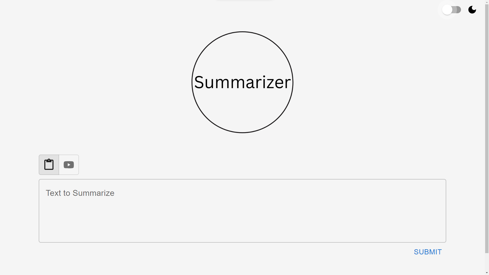
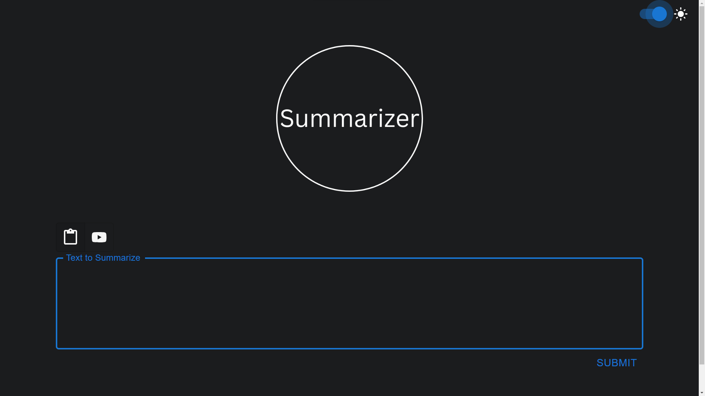
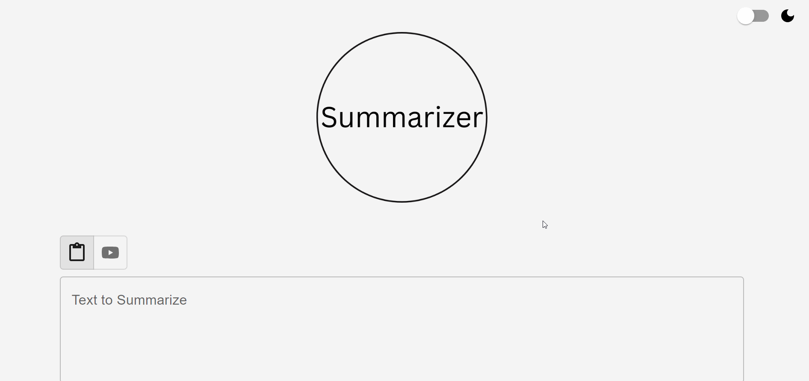

# Summarizer

## The Team

#### Jakin Chan 
- [x] GitHub: https://github.com/JakinChan200

#### Nathan Kong
- [x] GitHub: https://github.com/NathanKong06

#### Lizbeth Areizaga:
- [x] GitHub: https://github.com/liz-areizaga


## Overview
Summarizer is a user focused tool committed to enhancing the student experience. This tool provides the user with a simple and hassle-free process of summarizing either text or YouTube videos for quick and easy consumption. Also, we have dark mode.

## Tech Stack
### Frontend


### Backend


## Images
Summarizer Light Mode:

Summarizer Dark Mode:

Summarizer with Text:

Summarizer with YouTube Link:


## Installation
### Setup
1. Clone the repository by running this command.
    ```bash
    git clone https://github.com/liz-areizaga/summarizer.git
    ```
2. Navigate into the project directory using `cd`.
    ```bash
    cd summarizer
    ```
3. Install node.js

You can download it from the official website [See: node.js](https://nodejs.org/en)
### Python Flask Server
Any dependencies for Python are listed in `requirements.txt`. Ensure you have all Python dependencies by running:
```bash
pip install -r requirements.txt
```
Note: Use pip3 if you are using Python 3. If you do not have Python installed: [See: Guide](https://wiki.python.org/moin/BeginnersGuide/Download)
### NPM Dependencies
Once inside of the project directory, install all project dependencies.
```bash
npm install
```
### OpenAI API Key
You will need an OpenAI API Key. [See: HowToGeek Guide](https://www.howtogeek.com/885918/how-to-get-an-openai-api-key/) <br>
1. Once you have your OpenAI API Key, create a file named ```.env```. 
2. Move this file inside of the ```frontend``` directory. 
3. Add this line to the file and save. ```REACT_APP_OPENAI_API_KEY=AddYourAPIKeyHere```
Be sure to replace ```AddYourAPIKeyHere``` with your actual OpenAI API Key.

### Starting Summarizer
<!-- Start backend and frontend server -->
#### Frontend
1. Open a terminal and navigate to the frontend folder.
    ```bash
    cd frontend
    ```
2. Run the command below to start the frontend server.
    ```bash
    npm start
    ```
#### Backend
1. Open a new terminal and navigate to the backend folder.
    ```bash
    cd backend
    ```
2. Run the command below to start the backend server.
    ```bash
    python server.py
    ```
    Note: If you are using Python3, use ```python3``` instead of ```python```.

## Usage
### Dark and Light Mode
There is a dark mode and light mode toggle on the top right of the page. Use the toggle to switch between modes. 

### Text Summarization
For summarization of texts, click the left tab above the box (clipboard) and type or paste in your text. Once you are finished, hit the Submit button on the bottom right. For a demonstration, see the "Summarizer with Text" section in [Images](#images).

### YouTube Video Summarization
For summarization of a YouTube video, click the right tab above the box (YouTube logo) and paste in your YouTube link. Once you are finished, hit the Submit button on the bottom right. For a demonstration, see the "Summarizer with Youtube Link" section in [Images](#images).